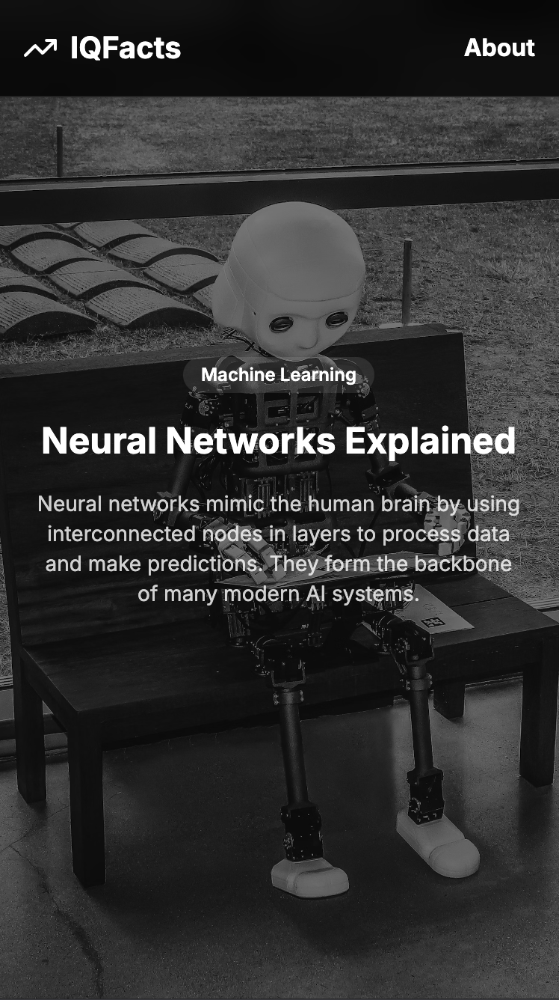

Below is an improved version of the README file for your GitHub repository, tailored to be professional, informative, and suitable for upload. It removes casual elements like emojis, enhances clarity, and provides all necessary details for users and contributors.

---

# IQ-SHORTS

IQ-SHORTS is an innovative short-video platform designed to enhance users' knowledge and cognitive abilities. Unlike traditional entertainment-focused apps, IQ-SHORTS delivers concise, engaging videos packed with fascinating facts aimed at stimulating intellectual growth.

## Key Features
- **Fact-Packed Shorts**: Engage with short, informative videos designed to expand your knowledge.
- **Sleek User Interface**: Experience a clean, intuitive design built with Next.js, Tailwind CSS, and ShadCN.
- **Smooth Animations**: Enjoy fluid transitions and interactions powered by Framer Motion.
- **Smart Discovery**: Benefit from a personalized content feed tailored to your interests.
- **Modern Design Elements**: A contemporary visual appeal achieved with Lucide-react and Radix UI.

## Tech Stack
- **Frontend**: Next.js, React, Tailwind CSS
- **Animations**: Framer Motion
- **UI Components**: ShadCN (built on Radix UI), Lucide-react
- **Package Manager**: Bun

## Installation
Before proceeding, ensure you have [Bun](https://bun.sh/) installed on your system. Clone the repository and run the following command to install the necessary dependencies:

```sh
bun i
```

## Running the Project
To start the development server, use the following command:

DO NOT FORGET!
```sh
bun i framer-motion
```

```sh
bun i lucide-react
```

```sh
bun i @radix-ui/react-tabs
```

```sh
bun dev
```

Once the server is running, open your browser and navigate to [http://localhost:3000](http://localhost:3000) to view the application.

## Screenshots


## Contributing
We welcome contributions from the community! If you have suggestions for improvements or new features, please feel free to submit issues or pull requests.

## License
MIT License © 2025 IQ-SHORTS

---

**"Learn something new in just 60 seconds!"**

---
